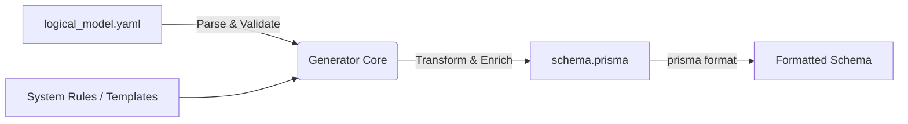

# 機能仕様書: Logical Model to Prisma Generator

## 1. はじめに

### 1.1. 背景と目的

本プロジェクトでは、システム設計とドメイン設計の分離を重視しています。

- **システム要件:** UUID v7の採用、論理削除、監査ログ、ユーザー定義リレーション（グラフ構造）など。
- **ドメイン要件:** 研究者、プロジェクト、データセットなど、ビジネス固有の定義。

これらを `schema.prisma` に直接記述すると、ドメイン定義とシステム実装詳細が混在し、保守性が低下します。本ツールは、**論理データモデル（YAML）を「正（Single Source of Truth）」** とし、そこにシステム要件を自動的に付加（Enrich）して `schema.prisma` を生成することで、仕様と実装の乖離を防ぎ、変更に強い開発基盤を提供することを目的とします。

### 1.2. 用語定義

- **Logical Model (Source):** `logical_model_schema.json` で定義されるスキーマに沿って `logical_model.yaml` で定義される、ビジネス観点での論理データモデル。
- **System Concerns:** UUID、作成日時、削除フラグなど、システム運用上必須だがビジネス定義には現れない属性。
- **Target Schema:** 生成される `schema.prisma` ファイル。

---

## 2. アーキテクチャ概要

### 2.1. データフロー



### 2.2. 技術スタック

- **Language:** TypeScript (Node.js)
- **Parser:** `yaml` (npm package)
- **Validation:** `ajv` (JSON Schema Validator) - `logical_model_schema.json` を使用
- **Output:** String Builder (または `prisma-ast` ライブラリの採用を検討)
  - Prisma のバージョンは v6 または v5 の最新版のうち、安定性や他の NPM パッケージとの相性を考慮して選択する。

---

## 3. 機能要件 (Functional Requirements)

### 3.1. 入力処理

1. **YAML読み込み:** 指定されたパス（デフォルト: `./logical_model.yaml`）からファイルを読み込む。
2. **スキーマ検証:** 読み込んだYAMLが `logical_model_schema.json` に適合しているか検証する。不適合の場合は具体的なエラー箇所を表示して終了する。

### 3.2. エンティティ変換ロジック (Model Enrichment)

論理エンティティを Prisma Model に変換する際、以下のルールを適用する。

#### 3.2.1. 命名規則の変換

- **Model Name:** PascalCase (例: `dmp_metadata` -> `DmpMetadata`, `Project` -> `Project`)
- **Field Name:** camelCase (例: `project_number` -> `projectNumber`)
- **Enum Name:** `{ModelName}{AttributeName}` (例: `DatasetAccessPolicy`)

#### 3.2.2. システムフィールドの注入 (System Injection)

全てのモデルに対し、YAMLの定義に関わらず以下を強制的に付与する。

- **Primary Key:** `id String @id @default(uuid())` (UUID v7対応)
- **Audit Fields:**
- `createdAt DateTime @default(now())`
- `updatedAt DateTime @updatedAt`
- `deletedAt DateTime?` (論理削除用)

#### 3.2.3. 主キーの扱い

- YAMLで `primary_key: true` とされた属性は、Prisma上では `@unique` 制約として扱う（物理PKは上記UUIDシステムIDとなるため）。

#### 3.2.4. 型マッピング

| YAML Type  | Prisma Type | 修飾子・備考                         |
| ---------- | ----------- | ------------------------------------ |
| `String`   | `String`    |                                      |
| `Integer`  | `Int`       |                                      |
| `Float`    | `Float`     |                                      |
| `Boolean`  | `Boolean`   |                                      |
| `Date`     | `DateTime`  | `@db.Date` を付与 (PostgreSQLの場合) |
| `DateTime` | `DateTime`  |                                      |
| `Text`     | `String`    | `@db.Text` を付与 (Large Text用)     |
| `Enum`     | `Enum`      | 生成されたEnum型を参照               |

### 3.3. リレーションシップの解決

YAMLの片方向定義から、Prismaの双方向リレーション定義を推論・生成する。

- **1:1 / 1:N 関係:**
- 親側に `RelationField[]` を追加。
- 子側に `relationField RelationField @relation(...)` と `relationId String` を追加。

- **属性付きリレーション (Relationship Attributes) の展開:**
- `logical_model.yaml` の `managed_by` のようにリレーションに属性がある場合、カーディナリティに応じて処理する。
- **1:1 / 1:N の場合:** 子モデル（Datasetなど）に直接属性カラムを展開する（例: `managedFrom`, `managedTo`）。
- **N:M の場合:** 中間テーブル（Model）を明示的に生成する。

### 3.4. 固定定義の結合 (Static Append)

ドメインモデルには含まれないが、システムアーキテクチャ上必要な定義（`UserDefinedRelationship` 等）をテンプレートとして保持し、生成ファイルの末尾に結合する。

---

## 4. インターフェース仕様 (CLI)

### 4.1. コマンド

`package.json` にスクリプトとして登録し、以下のコマンドで実行可能とする。

```bash
npm run generate:schema
```

### 4.2. オプション (将来拡張)

- `--input, -i`: 入力YAMLファイルのパス (Default: `logical_model.yaml`)
- `--output, -o`: 出力Prismaファイルのパス (Default: `prisma/schema.prisma`)
- `--dry-run`: ファイル書き込みを行わず、結果を標準出力する。

---

## 5. エラーハンドリング

- **構文エラー:** YAMLパースエラー時は行番号を表示。
- **検証エラー:** 必須属性の欠落、不正な型定義などは JSON Schema Validator のエラーメッセージを表示。
- **整合性エラー:**
- リレーション先（target）のエンティティが存在しない場合。
- 未定義の型が使用されている場合。

---

## 6. 開発・運用フロー

本ツール導入後の開発フローは以下の通りとする。

1. **モデル設計:** `logical_model.yaml` を編集・レビュー（ドメインエキスパートも参加可能）。
2. **コード生成:** `npm run generate:schema` を実行。
3. **差分確認:** 生成された `schema.prisma` のGit差分を確認。意図しないシステムフィールドの変更がないかチェック。
4. **マイグレーション:** `npx prisma migrate dev` でDBへ反映。

---

## 7. 実装に向けた参考資料・ライブラリ

- **Prisma Schema Reference:** [Prisma Schema API](https://www.prisma.io/docs/orm/prisma-schema)
- **YAML Parser:** `js-yaml` または `yaml`
- **AST Tools (Optional):** `prisma-ast` (より高度な書き換えが必要になった場合)
- **JSON Schema:** `ajv` (バリデーション用)
