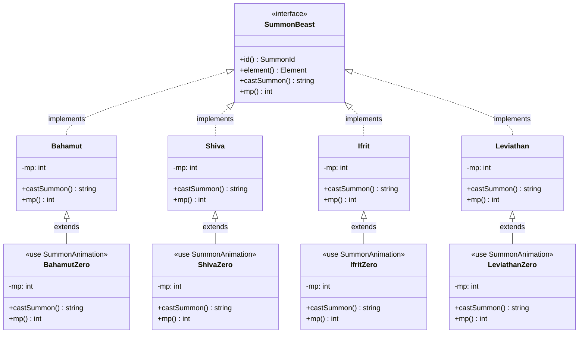

# バハムート駆動開発 クラス図 (第12章)

記事の第12章に示されたASCIIクラス図をMermaid形式に変換したものです。

```mermaid
classDiagram
    class SummonBeast {
        <<interface>>
        +id() SummonId
        +element() Element
        +castSummon() string
        +mp() int
    }

    class Bahamut {
        -mp: int
        +castSummon() string
        +mp() int
    }

    class Shiva {
        -mp: int
        +castSummon() string
        +mp() int
    }

    class Ifrit {
        -mp: int
        +castSummon() string
        +mp() int
    }

    class Leviathan {
        -mp: int
        +castSummon() string
        +mp() int
    }

    class BahamutZero {
        <<use SummonAnimation>>
        -mp: int
        +castSummon() string
        +mp() int
    }

    class ShivaZero {
        <<use SummonAnimation>>
        -mp: int
        +castSummon() string
        +mp() int
    }

    class IfritZero {
        <<use SummonAnimation>>
        -mp: int
        +castSummon() string
        +mp() int
    }

    class LeviathanZero {
        <<use SummonAnimation>>
        -mp: int
        +castSummon() string
        +mp() int
    }

    SummonBeast <|.. Bahamut : implements
    SummonBeast <|.. Shiva : implements
    SummonBeast <|.. Ifrit : implements
    SummonBeast <|.. Leviathan : implements

    Bahamut <|-- BahamutZero : extends
    Shiva <|-- ShivaZero : extends
    Ifrit <|-- IfritZero : extends
    Leviathan <|-- LeviathanZero : extends
```
